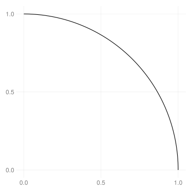
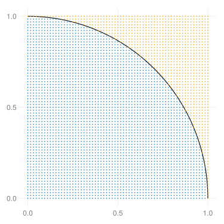
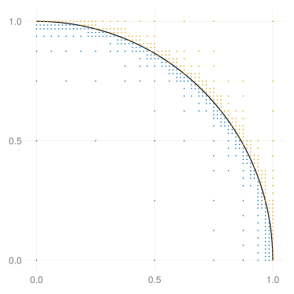
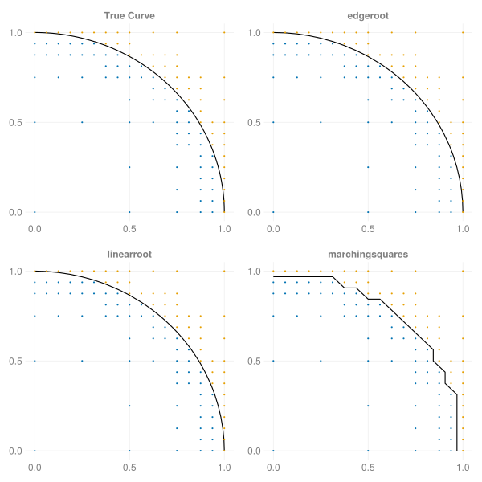

```@meta
CurrentModule = MultiBisect
```

# MultiBisect.jl

This Julia package provides a lightweight, idiomatic implementation of the [bisection method](https://en.wikipedia.org/wiki/Bisection_method) of root-finding in an arbitrary number of dimensions.

This package exports the `BisectionGrid` type, which tracks an `N`-dimensional bisection with only three `Array{Bool, N}`s and one `NTuple{N, R <: AbstractRange}`. Using ordinary boolean arrays not only uses minimal memory, but also leverages the magic of base Julia's `CartesianIndices` to handle any number of dimensions without code modification.

> [!IMPORTANT]
> This package, while functional, is still experimental and subject to change. For a more mature package with similar functionality, see [MDBM.jl](https://github.com/bachrathyd/MDBM.jl)

## Installation

This package is not yet registered, so installation is only available by url from the `pkg>` prompt:

```julia-repl
pkg> add https://github.com/jbshannon/MultiBisect.jl
```

## The Problem

The task of finding the root of a continuous function on an interval where its sign is known to change is a relatively well-known and simple problem, but extending the method to handle two or more dimensions adds complexity. For example, consider the unit circle on the domain $[0,1]^2$.

```julia
f(z) = 1 - sum(abs2, z)
circle = map(t -> (cos(t), sin(t)), 0:0.01:π/2)

using CairoMakie
fig = Figure(resolution = (500, 500))
ax = Axis(fig[1, 1])
lines!(ax, circle; color=:black)
fig
```


The naive, brute-force approach would be to evaluate the function on a grid of points, but many of these evaluations would be far away from the root (in two dimensions, a zero level curve) and not provide any information about the shape of the level curve.

```julia
xs = range(0, 1, length=65)
XS = Iterators.product(xs, xs) |> collect
F = f.(XS)

scatter!(ax, XS[F .> 0]; markersize=3)
scatter!(ax, XS[F .≤ 0]; markersize=3)
fig
```


The level curve must lie between the positive points and the negative points. Two adjacent points that share the same sign do not tell us anything about the level curve, so we could improve our efficiency if we avoided evaluating the function in regions where the sign does not appear to change.

## Bisection

Using the bisection method, we can reduce the number of function evaluations by increasing the fineness of the grid only in places we know the function must change sign. This package provides the function `bisect(f, grid)`, which applies the algorithm iteratively to the `grid` using the function `f`:

```julia
using MultiBisect
BG = bisect(f, (0.0:1.0, 0.0:1.0); iterations=7)
posx, negx = splitsign(BG)

fig = Figure(resolution = (500, 500))
ax = Axis(fig[1, 1])
lines!(ax, circle; color=:black)
scatter!(ax, posx; markersize=3)
scatter!(ax, negx; markersize=3)
fig
```


The resulting grid is the same size and identifies the exact same sign changes as before, but with far fewer function evaluations – nearly 90% fewer!

```julia-repl
julia> BG
BisectionGrid{Float64, 2}
       Domain: (0.0:0.015625:1.0, 0.0:0.015625:1.0)
  Grid points: 4225
  Evaluations: 490


julia> (xs, xs) == domain(BG)
true

julia> efficiency(BG) # percentage of gridpoints not evaluated
0.8840236686390532
```

This efficiency gain is possible because we known that if a square in the grid has vertices that are not all the same sign, the function must change sign somewhere within the square (this is of course only a necessary and not a sufficient condition). The method proceeds by dividing an initial grid "in half" (in the multidimensional sense) at each stage. Since we are working in two dimensions, we break each square into four smaller squares. Before evaluating the function, we check the sign of the function at teh vertices of the larger square. If the function does not change sign, there is no need to evaluate the function within the square. By discarding squares whose vertices all share the same sign at each iteration, we avoid uninformative function evaluations. Here is a step-by-step view of the algorithm:

https://github.com/jbshannon/MultiBisect.jl/assets/46204520/f4fa8893-f073-40f7-8907-84308b91cc65

## Interpolation

Once we're satisfied we have enough information about where the function changes signs, we need to convert that information into actual points along the curve. This package examines the *edges* of the grid: two adjacent points with opposite signs. 

```julia-repl
julia> edges(BG)
128-element Vector{Tuple{Tuple{Float64, Float64}, Tuple{Float64, Float64}}}:
 ((0.984375, 0.0), (1.0, 0.0))
 ((0.984375, 0.015625), (1.0, 0.015625))
 ((0.984375, 0.03125), (1.0, 0.03125))
 ((0.984375, 0.046875), (1.0, 0.046875))
 ((0.984375, 0.0625), (1.0, 0.0625))
 ⋮
 ((0.125, 0.984375), (0.125, 1.0))
 ((0.140625, 0.984375), (0.140625, 1.0))
 ((0.15625, 0.984375), (0.15625, 1.0))
 ((0.171875, 0.984375), (0.1875, 0.984375))
 ((0.171875, 0.984375), (0.171875, 1.0))
```

Since an edge is one-dimensional, we can convert the multidimensional root-finding problem to a series of one-dimensional problems. This packages provides the function `interpolate(rootfinder, BG)`, which takes a function `rootfinder` – taking an edge as input and returning a root as output – and applies it to each edge in the grid `BG`. This package currently provides three root-finders for convenience:

- `edgeroot`: solve for the root on the edge with a call to `Roots.find_zero`
- `linearroot`: create a linear interpolation of the function through the two edge points and compute its root
- `marchingsquares`: return the midpoint of the edge

Here is a visual comparison of these different interpolation methods:



## More dimensions!

Since Julia has the magical `CartesianIndices` iterator, translating this process out of two dimensions is as simple as changing the dimension of the initial evaluation grid. Here is an example finding roots of the 5d unit hypersphere over the unit 5d hypercube:

```julia
julia> grid = ntuple(i -> (0.0:1.0), 5)
(0.0:1.0:1.0, 0.0:1.0:1.0, 0.0:1.0:1.0, 0.0:1.0:1.0, 0.0:1.0:1.0)

julia> BG5 = bisect(f, grid)
BisectionGrid{Float64, 5}
       Domain: (0.0:0.0625:1.0, 0.0:0.0625:1.0, 0.0:0.0625:1.0, 0.0:0.0625:1.0, 0.0:0.0625:1.0)
  Grid points: 1419857
  Evaluations: 396246

julia> interpolate(linearroot(f), BG5)
124020-element Vector{NTuple{5, Float64}}:
 (1.0, 0.0, 0.0, 0.0, 0.0)
 (0.9979838709677419, 0.0625, 0.0, 0.0, 0.0)
 (0.9919354838709677, 0.125, 0.0, 0.0, 0.0)
 (0.9818548387096774, 0.1875, 0.0, 0.0, 0.0)
 (0.967741935483871, 0.25, 0.0, 0.0, 0.0)
 ⋮
 (0.0625, 0.0625, 0.125, 0.3125, 0.9375)
 (0.0, 0.08333333333333333, 0.125, 0.3125, 0.9375)
 (0.0, 0.0625, 0.1375, 0.3125, 0.9375)
 (0.0, 0.0625, 0.125, 0.3181818181818182, 0.9375)
 (0.0, 0.0625, 0.125, 0.3125, 0.9395161290322581)
```
